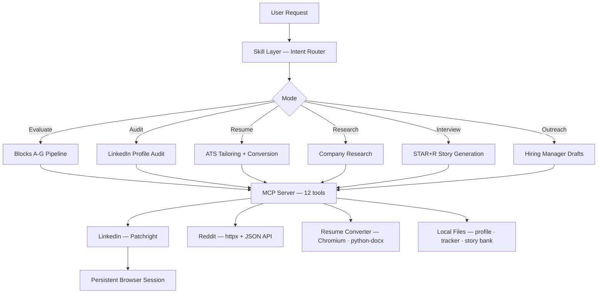

# Huntsman

MCP server for score-gated job hunting. LinkedIn scraping, Reddit salary intel, and resume conversion — only for roles that clear the 10-dimension threshold.

[](LICENSE)
[](https://pypi.org/project/huntsman-mcp/)
[](https://python.org)

<!-- TODO: Add demo.gif — screen capture of a full evaluate flow: paste a LinkedIn job URL, watch Huntsman scrape, score, and generate a tailored PDF resume inside Claude Code -->

## Overview

Job searching is a volume game played badly. Most applicants send the same resume to every role and treat rejection as a numbers problem. Huntsman flips that: it scores every job on 10 weighted dimensions before generating a single line of tailored material, so you apply to fewer roles with higher precision. The MCP server handles data acquisition across 12 tools — LinkedIn, Reddit, and resume conversion. The skill layer runs the evaluation engine, scoring, and outreach workflows entirely inside your LLM.

## Features

- **10-dimension scoring** — weighted matrix (North Star alignment, CV match, level fit, compensation, growth, remote quality, reputation, tech stack, speed to offer, culture) produces a 0–5 score with three decision gates
- **Score-gated pipeline** — below 3.0 gets a skip recommendation; 3.0–4.4 gets a tailored CV; 4.5+ gets the full pipeline including outreach drafts and STAR+R interview prep
- **LinkedIn scraping** — profiles, companies, jobs, job search with filters, and people search via Patchright with jitter-based navigation
- **Reddit intelligence** — salary threads, interview reports, and company reviews from cscareerquestions, ExperiencedDevs, and domain subreddits; no authentication required
- **ATS-compliant resume conversion** — Markdown to PDF (Chromium) or DOCX (python-docx), single-column layout, selectable UTF-8 text, standard section headers; DOCX for ATS portals, PDF for direct sends
- **Persistent session tools** — `load_profile`, `write_tracker`, and `write_story_bank` keep your profile, application log, and STAR+R story bank consistent across sessions without relying on the LLM to write files correctly
- **72 passing tests** — scraper helpers, converter sanitizer, and all file I/O tools covered

## Architecture



## Tech Stack

| Component | Technology |
|---|---|
| Runtime | Python 3.11+ |
| MCP framework | FastMCP 2.0 |
| LinkedIn scraping | Patchright (anti-detection Playwright fork) |
| Reddit | httpx · public JSON API (no auth) |
| Resume PDF | Patchright Chromium headless rendering |
| Resume DOCX | python-docx |
| Skill layer | Structured Markdown prompt files |

## Quickstart

**Prerequisites:** Python 3.11+, a LinkedIn account.

```bash
pip install huntsman-mcp
huntsman-mcp --setup           # download Patchright Chromium (~130 MB, one-time)
huntsman-mcp --login           # authenticate with LinkedIn (opens browser window)
cp config/profile.example.yml config/profile.yml   # fill in your details
huntsman-mcp --status          # confirm session is active
```

Run without installing: `uvx huntsman-mcp --setup` / `uvx huntsman-mcp --login`

Reddit tools work without authentication.

## Configuration

**Environment variables:**

| Variable | Description | Required |
|---|---|---|
| `HUNTSMAN_OUTPUT_DIR` | Resume output directory | No — default: `~/Downloads/` |
| `HUNTSMAN_PROJECT_DIR` | Project root for profile and tracker resolution | No — default: `cwd` |

**`config/profile.yml` fields:**

| Field | Description |
|---|---|
| `target_roles` | Roles you are targeting, in priority order |
| `tech_stack` | Skills split into: strong, working knowledge, familiar |
| `comp` | Minimum and preferred compensation + currency |
| `hard_nos` | Deal-breakers — trigger a −1.0 score penalty |
| `hero_metrics` | Best proof points used in outreach and cover letters |
| `archetype` | `builder` · `researcher` · `leader` · `specialist` · `generalist` |

If `config/profile.yml` is missing, the skill runs a 2-minute onboarding interview on first use.

## Usage

### Claude Code

Add to `~/.claude/mcp_servers.json`:

```json
{
  "huntsman": {
    "command": "uvx",
    "args": ["huntsman-mcp"]
  }
}
```

Install the skill:

```bash
cp -r skill ~/.claude/skills/huntsman
```

Then in Claude Code:

```
/huntsman evaluate this job: https://linkedin.com/jobs/view/4252026496
/huntsman tailor my resume for this role: [paste JD]
/huntsman optimize my LinkedIn for senior full-stack roles
/huntsman research Stripe
/huntsman prep for my interview at Coinbase for Protocol Engineer
/huntsman reach out to the hiring manager at Anthropic for the role I evaluated
/huntsman search for remote senior engineer jobs in fintech
/huntsman what's the salary for a staff engineer at Stripe?
```

### Codex CLI

Add to `~/.codex/config.toml`:

```toml
[[mcp_servers]]
name = "huntsman"
command = "uvx"
args = ["huntsman-mcp"]
```

Use `skill/SYSTEM_PROMPT.md` as your system context.

### ChatGPT Desktop

```json
{
  "huntsman": {
    "command": "uvx",
    "args": ["huntsman-mcp"]
  }
}
```

Paste `skill/SYSTEM_PROMPT.md` into your project instructions.

> **Note:** Profile loading, tracker writes, and story bank persistence require local filesystem access via the MCP server. Remote or API-only agents without local file access can still use all 12 tools directly but will not have profile-aware personalization across sessions.

### Session management

```bash
huntsman-mcp --status    # check if LinkedIn session is active
huntsman-mcp --login     # re-authenticate when session expires
huntsman-mcp --setup     # reinstall or update the browser
```

Sessions are stored at `~/.local/share/huntsman-mcp/browser_profile/`. Delete that directory to fully log out.

## LinkedIn Terms of Service

This tool scrapes LinkedIn using your own account session. LinkedIn's Terms of Service prohibit automated scraping. Using this tool carries a risk that LinkedIn may rate-limit, flag, or suspend your account. Request timing is conservative by default but not guaranteed. If your LinkedIn account is critical to an active job search, proceed with care.

## Contributing

Pull requests are welcome. For major changes, open an issue first to discuss what you'd like to change.

## License

Apache 2.0
