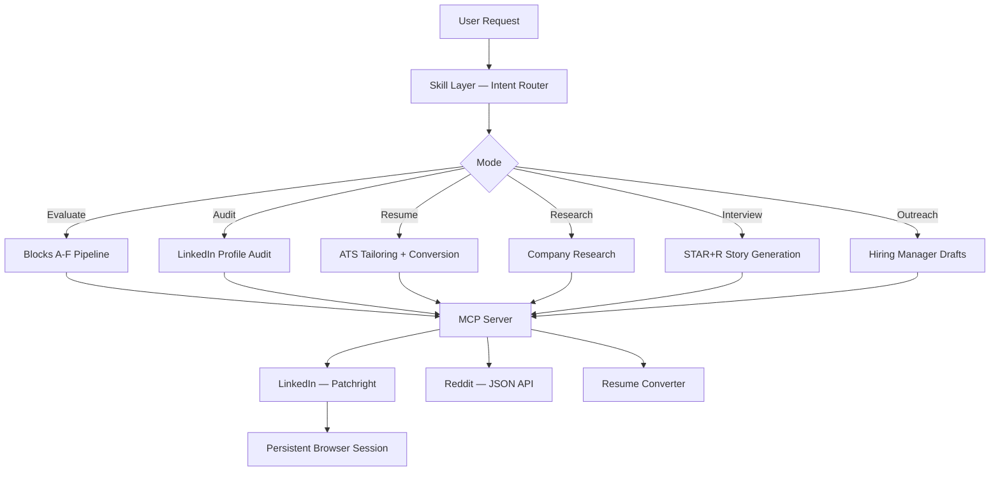

# Huntsman

Score-gated job hunting agent with LinkedIn scraping, Reddit intelligence, and resume conversion over MCP.

[](LICENSE)
[](https://python.org)

<!-- TODO: Add demo.gif — screen capture of a full evaluate-and-tailor flow in Claude Code -->

---

## Overview

Job searching is a volume game played badly. Most applicants spray the same resume everywhere and hope. Huntsman flips that: it scores every job on 10 weighted dimensions, gates application materials behind a quality threshold, and only generates tailored resumes for roles worth pursuing.

The MCP server handles data acquisition (LinkedIn scraping via Patchright, Reddit via public JSON API, resume conversion). The skill layer handles intelligence (evaluation engine, scoring matrix, interview prep, outreach drafting). The LLM connects the two.

---

## Features

- **10-dimension job scoring** — weighted matrix (North Star alignment, CV match, level fit, comp, growth, remote quality, reputation, stack, speed, culture) produces a 0-5 score with decision gates
- **LinkedIn scraping** — profiles, companies, job postings, job search with filters, people search via Patchright with jitter-based anti-detection
- **Reddit intelligence** — salary threads, interview reports, company reviews from cscareerquestions, ExperiencedDevs, and domain subreddits (no auth required)
- **Resume conversion** — Markdown to PDF (Chromium rendering) or DOCX (python-docx) with ATS-compliant single-column layout
- **Score-gated pipeline** — jobs below 3.0 get a skip recommendation, 3.0-4.4 get a tailored CV, 4.5+ get the full pipeline including outreach and interview prep
- **STAR+R interview stories** — mapped to JD requirements, stored in a reusable story bank across sessions
- **Profile-aware** — reads your target roles, tech stack, comp targets, and deal-breakers from a YAML config to personalize every evaluation

---

## Architecture



---

## Tech Stack

| Component | Technology |
|---|---|
| Runtime | Python 3.11+ |
| MCP framework | FastMCP 2.0+ |
| LinkedIn scraping | Patchright (anti-detection Playwright fork) |
| Reddit | httpx + public JSON API |
| Resume PDF | Patchright Chromium headless rendering |
| Resume DOCX | python-docx |
| Skill layer | Structured Markdown prompts (no code) |

---

## Quickstart

```bash
pip install huntsman-mcp             # install from PyPI
huntsman-mcp --setup                 # download Patchright Chromium (~130MB, one-time)
huntsman-mcp --login                 # authenticate with LinkedIn (opens browser)
huntsman-mcp --status                # verify session is active
cp config/profile.example.yml config/profile.yml   # fill in your details
```

Or run without installing via `uvx huntsman-mcp --setup` / `uvx huntsman-mcp --login`.

Prerequisites: Python 3.11+, a LinkedIn account.

Reddit tools work without any authentication.

---

## Configuration

### MCP Server Config

| Variable | Description | Required |
|---|---|---|
| `HUNTSMAN_OUTPUT_DIR` | Override resume output directory (default: `~/Downloads/`) | No |

### User Profile (`config/profile.yml`)

| Field | Description |
|---|---|
| `target_roles` | Roles you're targeting, in priority order |
| `tech_stack` | Primary, secondary, familiar skills |
| `comp` | Minimum and preferred compensation + currency |
| `hard_nos` | Deal-breakers that trigger a -1.0 score penalty |
| `hero_metrics` | Your best proof points for outreach and cover letters |
| `archetype` | builder, researcher, leader, specialist, or generalist |

If `config/profile.yml` is missing, the agent runs an onboarding interview on first use.

---

## Usage

### Claude Code

Add to `~/.claude/mcp_servers.json`:
```json
{
  "huntsman": {
    "command": "uvx",
    "args": ["huntsman-mcp"]
  }
}
```

Install the skill:
```bash
cp -r skill ~/.claude/skills/huntsman
```

Then use `/huntsman` in Claude Code:
```
/huntsman evaluate this job: [paste JD or LinkedIn job URL]
/huntsman optimize my LinkedIn for full-stack developer roles
/huntsman tailor my resume for this job: [paste JD]
/huntsman research [company name]
/huntsman prep for my interview at [company] for [role]
/huntsman reach out to the hiring manager at [company] for [role]
/huntsman search for remote senior engineer jobs in fintech
/huntsman what's the salary for a staff engineer at [company]?
```

### Codex CLI

Add to `~/.codex/config.toml`:
```toml
[[mcp_servers]]
name = "huntsman"
command = "uvx"
args = ["huntsman-mcp"]
```

Use `skill/SYSTEM_PROMPT.md` as your system context.

### ChatGPT Desktop

Add to your ChatGPT MCP config:
```json
{
  "huntsman": {
    "command": "uvx",
    "args": ["huntsman-mcp"]
  }
}
```

Paste `skill/SYSTEM_PROMPT.md` into your custom instructions or project context.

> **Note:** The full skill pipeline (profile loading, story bank, tracker updates) requires local filesystem access. ChatGPT Desktop supports this via the MCP server's file I/O. Remote or API-only agents without local file access can still use all 9 MCP tools directly but will not have profile-aware personalization or persistent story bank unless the profile content is passed explicitly in context.

### Any MCP-Compatible Agent

Configure the server as above. If your agent doesn't support MCP, paste `skill/SYSTEM_PROMPT.md` as the system prompt and the agent will ask users to paste content manually.

---

## Session Management

```bash
huntsman-mcp --status    # check if LinkedIn session is active
huntsman-mcp --login     # re-authenticate when session expires
huntsman-mcp --setup     # reinstall/update the browser
```

Sessions are stored at `~/.local/share/huntsman-mcp/browser_profile/`. Delete that directory to fully log out.

---

## Repository Structure

```
huntsman/
├── pyproject.toml              Package config (PyPI: huntsman-mcp)
├── LICENSE                     Apache 2.0
├── config/
│   └── profile.example.yml    Template for user profile
├── data/                      Runtime data (gitignored)
├── huntsman_mcp/
│   ├── server.py              FastMCP server — 9 tool definitions + CLI
│   ├── scraper.py             LinkedIn scraping (navigate-scroll-innerText)
│   ├── reddit.py              Reddit public JSON API client
│   ├── auth.py                Session management + login flow
│   ├── browser.py             Patchright persistent browser context
│   ├── converter.py           Markdown to PDF/DOCX resume conversion
│   ├── config.py              Paths, timing constants, filter maps
│   └── exceptions.py          Exception hierarchy
└── skill/
    ├── SKILL.md               Claude Code skill (/huntsman) — intent router
    ├── SYSTEM_PROMPT.md        System prompt for non-Claude-Code agents
    ├── _shared.md             Scoring matrix, ATS rules, language constraints
    └── modes/
        ├── evaluate.md        A-F block evaluation engine
        ├── research.md        Company research (LinkedIn + Reddit)
        ├── interview.md       STAR+R story generation + story bank
        └── outreach.md        Hiring manager identification + messaging
```

**Runtime files (gitignored):**
- `config/profile.yml` — your personal profile
- `cv.md` — your resume (source of truth, never fabricated)
- `data/applications.md` — job evaluation log with scores
- `data/story-bank.md` — reusable STAR+R interview stories

---

## LinkedIn ToS Notice

This tool scrapes LinkedIn using your own account session. LinkedIn's Terms of Service prohibit automated scraping. Using this tool carries a risk that LinkedIn may rate limit, flag, or suspend your account.

The session is stored locally. No credentials leave your machine. The default request timing is conservative but not bulletproof. If your LinkedIn profile is critical to an active job search, proceed with care.

---

## Contributing

Pull requests are welcome. For major changes, open an issue first to discuss what you'd like to change.

---

## License

Apache 2.0
